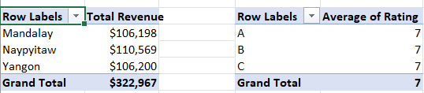
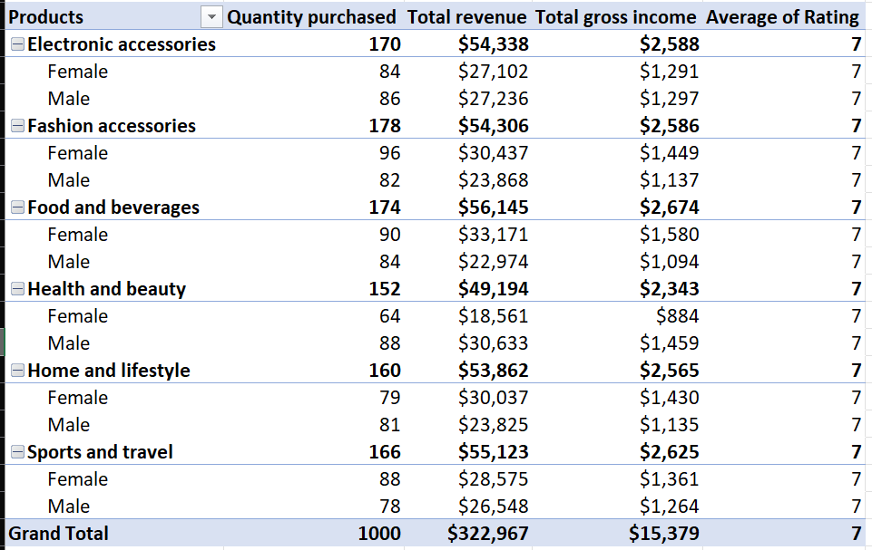
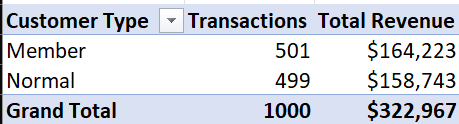

# Supermarket-sales-business-intelligence
This project aims to analyze 3 months(Jan, Feb, Mar) of supermarket sales data in Excel to evaluate business performance across branches and product lines, track revenue trends, assess tax contributions, and measure customer satisfaction. It provides actionable insights and recommendations to support informed business decisions.

## Objectives
- Analyze branch performance using revenue, transaction volume, average transaction value, and customer ratings.
- Identify the highest and lowest performing branches.
- Evaluate product line performance based on revenue, sales volume, and customer ratings.
- Identify top-selling and underperforming product categories.
- Analyze purchasing behaviour across different customer groups and genders.
- Examine revenue trends by month, day, and time of the day.
- Determine peak sales periods and customer shopping patterns.
- Measure sales efficiency through average basket value and transaction value.
- Compare branch productivity and customer spending behaviour.
- Assess tax contributions by branch and product line.
- Identify branches with the greatest growth opportunities
- Generate actionable insights to support data-driven business decisions and improve operational performance.

## Dataset Overview
| Field | Description |
|--------|------------|
| Branch | Store branch identifier (A,B,C) |
| City | City where each branch is located |
| Customer Type | Type of customer (Member or Normal) |
| Gender | Gender of the customer |
| Product Line | Category of products purchased |
| Unit Price | Price per single item |
| Quantity | Number of items purchased |
| Tax 5% | 5% tax applied on the transaction |
| Total | Final amount (Unit Price * Quantity + Tax)|
| Date | Date of purchase |
| Time | Time of purchase |
| Payment | Payment method used(Cash, Ewallet or Credit card) |
| COGS | Cost of goods sold |
| Gross Margin Percentage | Profit margin percentage per transaction |
| Gross Income | Profit earned from the transaction |
| Rating | Customer satisfaction score (out of 10) |

## Branches
| Branch | Name |
|------|--------|
| A | Yangon |
| B | Mandalay | 
| C | Naypyitaw |

## Key Insights
### Branch Performance Analysis
1. Naypyitaw generates the highest revenue
   - Total Revenue: $ 110,560
   - Average Revenue per Transaction: $337
   - Transactions: 328
  
Despite having fewer transactions than all the branches, C generates the highest overall revenue and the highest average revenue per transaction. This suggests customers in this branch tend to spend more per visit. 

2. Yangon serves the most customers
   - Transaction: 340
   - Total Revenue: $106,200
   - Average Revenue per Transaction: $312
  
A handles the highest customer volume but records the lowest average transaction value and total revenue, indicating higher customer traffic but lower spending per customer compared to other branches.

3. Mandalay Shows Strong Customer Spending
   - Transactions: 332
   - Total Revenue: $106,198
   - Average Revenue per Transaction: $320
  
Mandalay maintains a balanced performance with solid transaction volume and average spending. Its revenue is nearly identical to A despite serving fewer customers.

4. Customer Ratings are consistent across all branches, all averaging at 7/10. Customer satisfaction appears uniform across all branches, suggesting a consistent customer experience.

 

### Product Line Performance Analysis
The product lines include:
- Electronic Accessories
- Fashion Accessories
- Food and Beverages
- Health and Beauty
- Home and Lifestyle
- Sports and Travel

1. Revenue Performance
   - Highest Revenue: Food and Beverages-$56,145
   - Lowest Revenue: Health and Beauty-$49,194
  
Food and Beverages emerges as the strongest revenue-generating category, while Health and Beauty underperforms despite a steady supply.

2. Sales Volume
   - Highest Quantity Sold: Fashion Accessories-178 transactions
   - Lowest Quantity Sold: Health and Beauty-152 transactions
  
Fashion Accessories leads in sales volume, indicating high customer demand, while Health and Beauty records the lowest activity.

Insight: Even though Fashion Accessories leads in sales volume, it does not lead in revenue, suggesting a lower average transaction value compared to Food and Beverages, which generates higher revenue with fewer transactions.

3. Customer Ratings
Customer satisfaction remains consistent across all product categories, averaging at 7/10, indicating stable service and product experience.

4. Gender-Based Analysis
   -Female Customers: 501 transactions
   -Male Customers: 499 transactions

Females slightly lead in overall transactions.

Gender Preferences:
- Female-dominated product lines:
  - Fashion Accessories
  - Food and Beverages
  - Sports and Travel
 
- Male-dominated product lines:
  - Electronic Accessories
  - Health and Beauty
  - Home and Lifestyle.

Gender distribution is nearly balanced, with a slight female dominance. Product preferences vary clearly between male and female customers.

5. Customer Type Analysis(Member vs Normal)
The analysis also explores customer segmentation based on membership status.
- Members: 510 transactions | Total Revenue: $164,223
- Normal Customers: 499 transactions | Total Revenue: $158,743

Members slightly lead in both total transactions and revenue, indicating stronger purchasing power and higher engagement compared to normal customers. This suggests that having a membership may positively influence customer loyalty and spending behaviour. 

### Revenue And Sales Timing Analysis
This section analyzes supermarket revenue patterns across months, days, and time periods to understand when customers shop the most and when the business generates the highest sales.

1. Monthly Revenue Trend

The dataset covers three months: January, February, and March.
- Highest Revenue Month: January - $116,292
- Lowest Revenue Month:  February - $97,219

January recorded the highest total revenue, indicating stronger customer purchasing activity. In contrast, February generated the lowest revenue, suggesting a possible decline in sales activity or lower customer spending.

To further understand customer purchasing behaviour within each month, the month was divided into three periods:
- Early Month
- Mid Month
- End Month
  
This helps to identify whether customers spend more at the beginning, middle, or end of the month.

- Highest Revenue Month Period: Early Month - $113,876
- Lowest Revenue Month Period: End Month - $100,171

The Early Month period generated the highest revenue, indicating that customers were more active then. This may be influenced by salary payments, budgeting habits, or increased shopping needs at this point in the month.

Insight: Analyzing revenue by both month and period gives a clearer view of customer spending patterns. It helps the supermarket understand not only which month performed best, but also when, within each month, customers are most likely to spend. 

2. Sales by Time of the Day

Transaction times were grouped into different time periods:
- Mid Morning
- Afternoon
- Lunch Time
- Evening

- Highest Revenue Time Period: Lunch Time - $91,618
- Lowest Revenue Time Period: Mid Morning - $61,799
- Highest Transaction Time Period: Evening - 281 Transactions
- Lowest Transaction Time Period: Mid Morning - 191 Transactions 

Sales by time of the day show that the evening period recorded the highest number of transactions. This means more customers made purchases during the evening compared to other times of the day.
However, lunch time generated the highest total revenue despite having fewer transactions than the evening period. This suggests that customers who shop during lunch time tend to spend more per transaction.

Insight: Although evening is the busiest period in terms of customer activity, lunch time is the most valuable period in terms of revenue. The supermarket can use this insight to maintain strong staffing during evening hours while also focusing on promotions and product availability around lunch time to maximize revenue.

3. Sales by Day of the Week

Sales were analyzed by day of the week to identify the busiest shopping days.

- Highest Sales Day: Saturday - $56,121
- Lowest Sales Day: Monday - $37,899
- Highest Transaction Day: Saturday - 164 Transactions
- Lowest Transaction Day: Monday - 125  Transactions

Saturday emerges as the strongest sales day, recording both the highest revenue and the highest number of transactions, indicating that customer traffic and spending activity are highest on Saturdays.
In contrast, Monday recorded both the lowest revenue and the lowest number of transactions, showing weaker customer activity.  

Insight: Since Saturday has the highest customer activity and revenue, the supermarket should ensure enough staff, checkout support, and inventory are available to meet demand. Monday presents an opportunity for improvement through targeted promotions, discounts, or loyalty offers to encourage more customer visits and increase sales. 

4. Peak Purchasing Hour

The transaction time was also analyzed by hour to identify the exact peak shopping hour.

- Peak Purchasing Hour by Revenue: 7 PM - $39,000
- Peak Purchasing Hour by Transaction: 7 PM - 113 Transactions
- Lowest Purchasing Hour by Revenue: 8 PM - $22,970
- Lowest Purchasing Hour by Transaction: 5 PM - 74 Transactions, also noting that 8 PM -75 Transactions

7 PM emerged as the peak purchasing hour, recording both the highest revenue and the highest number of transactions. This indicates that customer traffic and spending are strongest during this hour.
The lowest revenue was recorded at 8 PM, while the lowest number of transactions was recorded at 5 PM with 74 transactions. However, 8 PM recorded 75 transactions, only one more than 5 PM, showing both hours had relatively low activity.

Insight: Since 7 PM is both the busiest and highest revenue-generating hour, the supermarket should prioritize staffing, stock availability, and checkout efficiency during this period. The low revenue at 8 PM, despite having almost the same transaction count as 5 PM, suggests lower average spending per transaction, creating an opportunity for promotions or upselling during that hour. 

5. Branch Sales Timing Comparison

Sales timing was compared across the three branches: 

- Yangon - 11 AM
- Mandalay - 7 PM
- Naypyitaw - 7 PM

Yangon generated its highest revenue at 11 AM, while Mandalay and Naypyitaw both recorded their highest at 7 PM.

Insight: Yangon has a stronger late-morning sales pattern, while Mandalay and Naypyitaw perform best in the evening. This shows that customer shopping behaviour differs by branch, so staffing, inventory planning, and promotions should be adjusted based on each branch's peak revenue hour.

  

