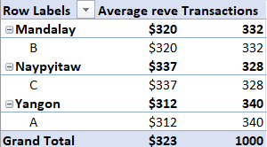

# Supermarket-sales-business-intelligence
This project aims to analyze supermarket sales data in Excel to evaluate business performance across branches and product lines, track revenue trends, assess tax contributions, and measure customer satisfaction. It provides actionable insights and recommendations to support informed business decisions.

## Objectives
- Analyze branch performance using revenue, transaction volume, average transaction value, and customer ratings.
- Identify the highest and lowest performing branches.
- Evaluate product line performance based on revenue, sales volume, and customer ratings.
- Analyze purchasing behaviour across different customer groups and genders.
- Identify top-selling and underperforming product categories.
- Examine revenue trends by month, day, and time of the day.
- Determine peak sales periods and customer shopping patterns.
- Measure sales efficiency through average basket value and transaction value.
- Compare branch productivity and customer spending behaviour.
- Assess tax contributions by branch and product line.
- Identify branches with the greatest growth opportunities
- Generate actionable insights to support data-driven business decisions and improve operational performance.

## Dataset Overview
| Field | Description |
|--------|------------|
| Branch | Store branch identifier (A,B,C) |
| City | City where each branch is located |
| Customer Type | Type of customer (Member or Normal) |
| Gender | Gender of the customer |
| Product Line | Category of products purchased |
| Unit Price | Price per single item |
| Quantity | Number of items purchased |
| Tax 5% | 5% tax applied on the transaction |
| Total | Final amount (Unit Price * Quantity + Tax)|
| Date | Date of purchase |
| Time | Time of purchase |
| Payment | Payment method used(Cash, Ewallet or Credit card) |
| COGS | Cost of goods sold |
| Gross Margin Percentage | Profit margin percentage per transaction |
| Gross Income | Profit earned from the transaction |
| Rating | Customer satisfaction score (out of 10) |

## Branches
| Branch | Name |
|------|--------|
| A | Yangon |
| B | Mandalay | 
| C | Naypyitaw |

## Key Insights
### Branch Performance Analysis
1. Naypyitaw generates the highest revenue
   - Total Revenue: $ 110,560
   - Average Revenue per Transaction: $337
   - Transactions: 328
  
Despite having fewer transactions than all the branches, C generates the highest overall revenue and the highest average revenue per transaction. This suggests customers in this branch tend to spend more per visit. 

2. Yangon serves the most customers
   - Transaction: 340
   - Total Revenue: $106,200
   - Average Revenue per Transaction: $312
  
A handles the highest customer volume but records the lowest average transaction value and total revenue, indicating higher customer traffic but lower spending per customer compared to other branches.

3. Mandalay Shows Strong Customer Spending
   - Transactions: 332
   - Total Revenue: $106,198
   - Average Revenue per Transaction: $320
  
Mandalay maintains a balanced performance with solid transaction volume and average spending. Its revenue is nearly identical to A despite serving fewer customers.

4. Customer Ratings are consistent across all branches, all averaging at 7/10

Customer satisfaction appears uniform across all branches, suggesting a consistent customer experience.

